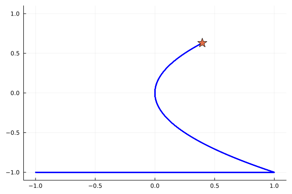

# StayOnTheRidge.jl
[](https://gitlab.fel.cvut.cz/kosohmar/StayOnTheRidge.jl/-/blob/main/LICENSE)

This package implements the STay-ON-the-Ridge algorithm, designed to find min-max critical points of nonconvex-nonconcave functions. Further details about the algorithm can be found in the associated paper at https://proceedings.mlr.press/v195/daskalakis23b.html.

This project, currently in progress, is being developed as part of a Bachelor's thesis at the Faculty of Electrical Engineering, Czech Technical University in Prague.

## Instalation
The package is not registered and this can be installed in the following way

```julia
(@v1.9) pkg> add https://gitlab.fel.cvut.cz/kosohmar/StayOnTheRidge.jl
```

## Description
STON'R algorithm needs to compute the gradient and hessian of the function. This implementation is able to switch between symbolic computation (for testing purposes) and computation using the ForwardDiff package (which will be used in the future for multidimensional functions).

## Example
Example using ForwardDiff differentiation:

```julia
using StayOnTheRidge

function H_closure(a, b) # extend domain to the general hypercube
    function H(x)
        return a .+ (b .- a) .* x
    end
end

n = 2 # number of variables
min_coords = [2] # indices of minimizing coordinates
γ = 1e-3 # step size
ϵ = 1e-1 # precision
H = H_closure(-1,1)

f(x) = 2*x[1]*x[2]^2-x[1]^2-x[2]
config = Config_FD(f, n, min_coords, γ, ϵ; H)
elapsed = @elapsed min_max, trajectory, m, k = run_dynamics(config)
pretty_print(config.H(min_max), elapsed, m, k)
plot_trajectory2D(config.H(min_max), config.H.(trajectory), -1, 1)
```

<p align="center">
  
</p>

For more examples see examples/examples.jl

