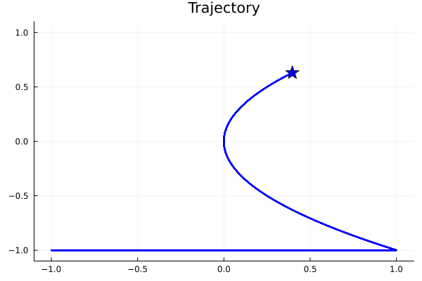

# StayOnTheRidge.jl
[](https://gitlab.fel.cvut.cz/kosohmar/StayOnTheRidge.jl/-/blob/main/LICENSE)

This package implements the STay-ON-the-Ridge algorithm (STON'R), designed to find min-max critical points of possibly nonconvex-nonconcave functions. The concepts of min-max critical points and the STON'R algorithm were proposed in https://proceedings.mlr.press/v195/daskalakis23b.html.

This is a project in progress, developed as part of a Bachelor's thesis at the Faculty of Electrical Engineering, Czech Technical University in Prague.

## Instalation
The package is not registered and this can be installed in the following way

```julia
(@v1.9) pkg> add https://gitlab.fel.cvut.cz/kosohmar/StayOnTheRidge.jl
```

## Description
The STON'R algorithm involves the computation of the gradient and hessian of the function. This implementation is able to switch between symbolic computation (using Symbolics.jl) and automatic differentiation (using ForwardDiff.jl package).

## Example
### Function $2x_1x_2^2 - x_1^2 - x_2$ on the square $\[-1,1\]^2$
The algorithm operates on the unit hypercube $\[0,1\]^n$. The domain can be extended to the general convex set $K$ by defining mapping $H$ from $\[0,1\]^n$ to $K$.
The current implementation assumes a general hyperrectangle domain, passed to the config as the last argument.

Execution using ForwardDiff differentiation:
```julia
using StayOnTheRidge

n = 2 # number of variables
min_coords = [2] # indices of minimizing coordinates
γ = 1e-3 # step size
ϵ = 1e-1 # precision

f(x) = 2*x[1]*x[2]^2-x[1]^2-x[2]
config = Config_FD(f, n, min_coords, γ, ϵ, [[-1,1],[-1,1]])
elapsed = @elapsed min_max, trajectory, m, k = run_dynamics(config)
pretty_print(config.H(min_max), elapsed, m, k)
plot_trajectory2D(config.H(min_max), config.H.(trajectory), [-1,1], [-1,1])
plot_contour2D(config.H(min_max), config.f, [-1,1], [-1,1])
plot_surface(config.H(min_max), config.f, [-1,1], [-1,1])
```

<p align="center">
  
</p>
<p align="center">
  
</p>

For more examples see examples/examples.jl

